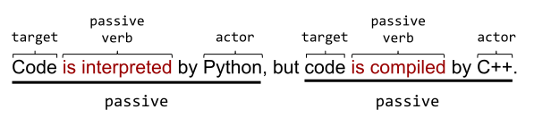

# 主动语态 vs . 被动语态

[[toc]]

技术写作中的绝大多数句子都应该使用主动语态。本单元教您如何执行以下操作：

* 区分被动语态和主动语态。
* 将被动语态转换为主动语态，因为主动语态通常更清晰。

## 简单句中主动语态与被动语态的区分

在主动语态句中，一个主语对一个目标采取行动，主动语态句遵循以下公式:
> 主动语态句子 = 主语 + 动词 + 目标

一个被动语态句子会颠倒这个公式，一个被动语态句子通常遵循以下公式:
> 被动句 = 目标 + 动词 + 主语
### 主动语态示例

例如，这是一个简短的主动语态句子：

> 猫坐在垫子上。

* 主语：猫
* 动词：坐
* 目标：垫子

### 被动语态例子

相比之下，这是被动语态中的同一句话：

> 垫子被猫坐着。

* 目标：垫子
* 被动动词：被坐
* 主语：猫

一些被动语态句子省略了主语。例如：

> 垫子被坐了。

* 演员：_不详_
* 被动动词： 被坐
* 目标：垫子

谁或什么坐在垫子上？一只猫？一只狗？霸王龙？读者只能猜测。技术文档中的好句子应该表明**谁对谁做什么**。

## 识别被动动词

被动动词通常具有以下公式：

> 被动动词 = 系动词（be 动词） + 过去分词
 
passive verb = form of be + past participle verb

尽管前面的公式看起来令人生畏，但它实际上非常简单:

* A. **系动词（be 动词）** 典型的有:
    * is/are
    * was/were

* **过去分词** 通常是一个普通动词加上后缀 ed。举例来说:
    * interpreted
    * generated
    * formed

不幸的是，一些过去分词动词是不规则的，也就是说，部分过去分词的后缀并不是 ed。例如:

* sat
* known
* frozen

**系动词（be）** 和 **过去分词** 连在一起就产生了被动动词，例如:

* was interpreted
* is generated
* was formed
* is frozen

如果短语中包含一个主语，则通常在被动动词后面加上介词。(介词通常是帮助你辨认被动语态的关键线索。) 下面的例子结合了被动动词和介词:

* was interpreted as 被解释为
* is generated by 是由
* was formed by 是由
* is frozen by 被冰封在

### 祈使动词通常是主动的

以 **祈使动词** 开头的句子很容易被错误地归类为被动句。祈使动词是发出指令的动词的一种形式，下面列表中的多项都是以命令式动词开头。例如，下面列表中的 Open 和 Set 都是祈使动词:

* Open the configuration file.
* Set the Frombus variable to False.

以祈使动词开头的句子通常是主动语态，即使他们没有明确提到主语。并且，以祈使动词开头的句子暗示了一个主语。暗指的主语就是你。

### 练习

将下列句子分别标记为被动句和主动句:

1. MutableInput provides read-only access.
 
MutableInput 提供只读访问。

2. Read-only access is provided by MutableInput.
 
只读访问由 MutableInput 提供。

3. Performance was measured.
 
表现是衡量

4. Python was invented by Guido van Rossum in the twentieth century.
 
Python 是吉多·范罗苏姆在20世纪发明的。

5. David Korn discovered the KornShell quite by accident.
 
大卫 · 科恩发现 KornShell 完全是偶然的。

6. This information is used by the policy enforcement team.
 
策略执行小组使用此信息。

7. Click the Submit button. 
 
点击提交按钮

8. The orbit was calculated by Katherine Johnson.
 
这个轨道是由凯瑟琳 · 约翰逊计算的。

::: details 查看答案
1. Active. MutableInput provides read-only access.
 
主动。 MutableInput 提供只读访问。

2. Passive. Read-only access is provided by MutableInput.
 
被动。只读访问是由 MutableInput 提供的。

3. Passive. Performance was measured.
 
被动。表现被衡量。

4. Passive. Python was invented by Guido van Rossum in the twentieth century.
 
被动。是吉多·范罗苏姆在20世纪发明的。

5. Active. David Korn discovered the KornShell quite by accident.
 
主动。大卫 · 科恩发现 KornShell 完全是偶然的。

6. Passive. This information is used by the policy enforcement team.
 
被动。策略执行小组使用此信息。

7. Active. Click the Submit button. (Click is an imperative verb.)
 
主动。点击提交按钮。(Click 是一个命令动词。)

8. Passive. The orbit was calculated by Katherine Johnson.
 
被动。这个轨道是由凯瑟琳 · 约翰逊计算的。
:::

## 复杂句中主动语态与被动语态的区分

许多句子包含多个动词，有些是主动的，有些是被动的。例如，下面的句子包含两个动词，都是被动语态:

Here is that same sentence, partially converted to active voice:

下面是同一个句子，部分转换成主动语态:

下面是同样的句子，现在完全转换为主动语态:

### 练习
下面的每个句子包含两个动词。把下列句子中的每个动词分为主动和被动。例如，如果第一个动词是主动的，第二个是被动的，写主动的，被动的。

1. The QA team loves ice cream, but the writers prefer sorbet.

2. Performance metrics are required by the team, though I prefer wild guesses.

3. When software engineers attempt something new and innovative, a reward should be given.

::: details 查看答案

1. Active, Active. The QA team loves ice cream, but the writers prefer sorbet.
2. Passive, Active. Performance metrics are required by the team, though I prefer wild guesses.
3. Active, Passive. When software engineers attempt something new and innovative, a reward should be given.

:::

## 选择主动语态而不是被动语态

大部分时间使用主动语态，少用被动语态。主动语态有以下优点:

大多数读者在心理上将被动语态转换为主动语态。为什么要给你的读者额外的处理时间呢？坚持使用主动语态，读者可以跳过预处理阶段，直接进入编译阶段。

被动语态把你的观点变模糊，使句子变得混乱不堪。被动语态间接地反应主语。

有些被动语态的句子完全省略了主语，这迫使读者猜测主语的身份。

主动语态一般比被动语态短。

