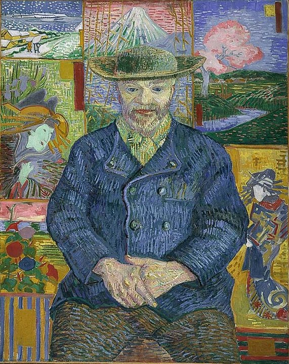
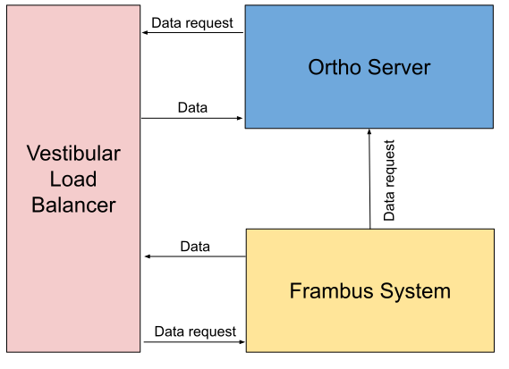
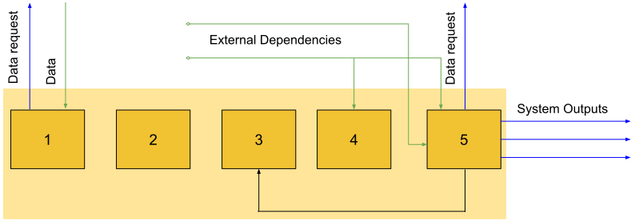
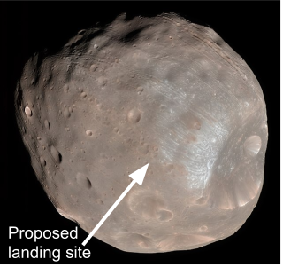
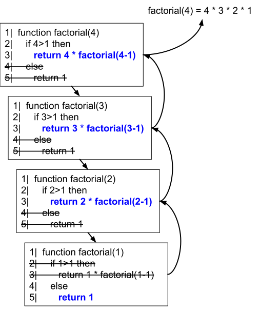

# 插图

[[toc]]

还记得你的老师给你分配了一大章要阅读的内容吗？你翻阅了教科书的指定部分，拼命地希望……是的，图片！查看插图比阅读文本有趣得多。事实上，当涉及到阅读技术材料时，绝大多数成年人仍然是小孩子--仍然渴望图片而不是文字。

**图 1. 好图片用文字做不到的方式吸引读者。**

[Nirmal Dulal [CC BY-SA 4.0 (https://creativecommons.org/licenses/by-sa/4.0)]](https://commons.wikimedia.org/wiki/File:Nepalese_Children.JPG)

根据[Sung 和 Mayer (2012) 的研究](https://www.sciencedirect.com/science/article/pii/S0747563212000921)，提供任何图片——无论好坏——都会让读者更喜欢文档；然而，只有具有*指导意义的*图片才能帮助读者学习。本单元建议了一些方法来帮助您创建真正价值一千字的数字。

## 先写标题

*在*创建插图*之前*先写下标题，通常很有帮助。然后，创作最能代表标题的插图。这个过程有助于你检查插图是否与目标相符。

好的标题具有以下特点：

* 它们很**简短**。通常，标题只是几个词。
* 它们解释了**收获**。*看完这张图，读者应该记住什么？*
* 它们**聚焦**读者的注意力。当照片或图表包含大量细节时，焦点尤为重要。

**注意：** 按照惯例，标题始终在图表后面。

### 练习

目标读者：参加“数据结构导论”课程的计算机本科生。

考虑以下三个图，每个图都使用相同的标题。

**说明 A. 单链表保存内容和指向下一个节点的指针。**

**说明 B. 单链表保存内容和指向下一个节点的指针。**

**说明 C. 单链表保存内容和指向下一个节点的指针。**

前面三个图中哪一个最能说明其标题？

:::details 查看答案
* 图 A 不好，链条很漂亮，但是没有信息。这个链条还错误的暗示了单个链表可能指向后面也可能指向前面
* 图B没问题。插图帮助学生意识到第一项指向第二项，第二项指向第三项，依此类推。但是，图片标题中同时说明了内容和指针，但插图仅显示指针，没有显示内容。
* 图 c 是最好的和最有指导意义的选择。图中清楚地描述了从指针部分到每个节点的内容部分。
:::

## 限制单个图片中的信息量

很少有智力任务能像研究一幅精美的画作一样有益，逐渐揭示洞察力和意义的层次。人们花很多钱在世界艺术博物馆中做到这一点。

很少有智力任务能像研究一幅精美的画作那样有价值，逐渐揭示出洞察力和意义的层次。人们花大价钱在世界各地的艺术博物馆里做这样的事情。

**图2 你会很高兴地研究这幅梵高的画作。**

[Portrait of Pere Tanguy By Vincent van Gogh - Musée Rodin [Public domain]](https://commons.wikimedia.org/wiki/File:Van_Gogh_-_Portrait_of_Pere_Tanguy_1887-8.JPG)

相比之下，像下面这样的高度复杂的技术插图往往会让大多数读者望而却步：

**图3 复杂的框图让读者不知所措。**

就像避免过长的句子一样，也要努力避免视觉上的复杂。根据经验，不要在一个图表中放置超过一个段落的信息。（另一种经验法则是避免使用需要超过五个项目符号来解释的插图。）你可能会说 "但现实生活中的技术系统可能比图 3 中所示的系统复杂得多"。 你是对的，但你不会觉得有必要在一个段落中解释现实生活中的复杂系统。

将视觉上的杂乱无章削成一些连贯和有用的东西的诀窍是将复杂的系统组织成子系统，就像下图所示。

**图4 一个由三个子系统组成的复杂系统。**

在展示"大图"之后，提供每个子系统的单独插图。

**图5 复杂系统的一个子系统的扩展细节。**

或者，从简单的“大图”开始，然后在每个后续插图中逐渐扩展细节。

## 吸引读者的注意力

当面对如下复杂的屏幕截图时，读者很难确定什么是要关注的：

**图6 读者不知道该关注什么。**

添加视觉提示，例如下图中的红色椭圆，有助于读者专注于屏幕截图的相关部分：

**图7 读者关注不一样的形状。**

**标注**提供了另一种吸引读者注意力的方式。对于图片和线框图，标注可以帮助我们的眼睛找到正确的着陆点。图片中的标注通常比对图片的段落长解释更好，因为标注将读者的注意力集中在图片的最重要方面。然后，在你的解释中，你可以直接关注图表的相关部分，而不是花时间描述你正在谈论的图像部分。

在示例图像中，标注和箭头可快速将读者引导至目的。

**图8 标注引导读者的视线。**

[NASA / JPL-Caltech / University of Arizona [Public domain]](https://commons.wikimedia.org/wiki/File:Phobos_colour_2008.jpg)

## 说明是重新说明

与写作一样，很少能把插图的初稿做到足够好。修改插图以阐明内容。当你修改时，问自己以下问题：

* 如何简化插图？
* 我应该将这个插图分成两个或更多个更简单的插图吗？
* 插图中的文字是否容易阅读？文字与其背景是否有足够的对比？
* 有什么收获？

例如，考虑[伦敦地铁地图的演变](https://wikipedia.org/wiki/Tube_map#History) 。1931 年之前，地铁图是按比例绘制的，上面有地面道路和地铁线路，随着轨道的弯曲而弯曲。

**图9 1908 年的伦敦地铁与地上道路的比例地图。**

[Public domain](https://commons.wikimedia.org/wiki/File:Tube_map_1908.jpg)

1931 年，Harry Beck 开创了一种新型公共交通地图，通过移除地上标记和比例尺来简化旧地图。相反，他的设计专注于使用地图的人真正关心的事情：从 A 站到 B 站。即使他 1931 年的地图取得了成功，贝克仍然在图上迭代多年，以简化和阐明地图。现在考虑一下[现代地铁图](https://www.google.com/search?tbm=isch&q=london+tube+map)，虽然出现了新的线路和车站，但它们仍然接近贝克的设计。

### 练习

思考以下原始插图：

**图10 复杂图形。**

上图的要点应该是：

> 对于递归解决方案，请在 return 语句中调用函数本身，直到达到基本情况解决方案。

图表的复杂性在哪些方面隐藏了要点？您将如何解决这些问题？

::: details 查看答案
该图可能存在以下这些问题：
* 问题：明亮的颜色会转移读者对图表的其他方面的注意力。
 
解决方案：仔细选择颜色，不要让它们盖过图表。

* 问题：该图没有足够的颜色对比。这使得一些视力低下或者视觉障碍的人难以理解该图。 
 
解决方案：移出不必要的颜色，并确保颜色符合[标准的色彩对比建议](https://material.io/design/color/text-legibility.html#legibility-standards)。

* 问题：箭头指向两个方向，使人分不清图表的流向
 
解决方案：把箭头分成两部分，一组说明调用函数的方向，另一组说明返回值的方向。

图中还有其他的问题，在此不一一列举。
:::

这是一个改进的插图：

**图11 上图的简化版本。**

您在改进后的插图中看到了哪些缺陷？

::: details 查看答案

这里有两个仍然存在的缺陷：

* 这个图表还是太复杂了。要解释这个例子，光用一段文字是远远不够的。考虑如何删除额外的信息或添加澄清标签可以简化解释。

* 当函数相互调用或返回数据时，分隔箭头有助于显示数据，但是能加上说明返回值是什么的标签，对读者会更有益。

:::

## 插图工具

创建图表有很多方式。这里有三个免费的和付费的工具：

* [Google Drawings](https://drawings.google.com)
* [diagrams.net](https://diagrams.net)
* [LucidChart](https://www.lucidchart.com/pages/)

从这些工具导出图表以用于文档时，通常最好将文件导出为[可缩放矢量图形](https://wikipedia.org/wiki/Scalable_Vector_Graphics)(SVG)。SVG 格式可根据空间限制轻松缩放图表，因此无论大小如何，您都可以获得高质量的图像。

  